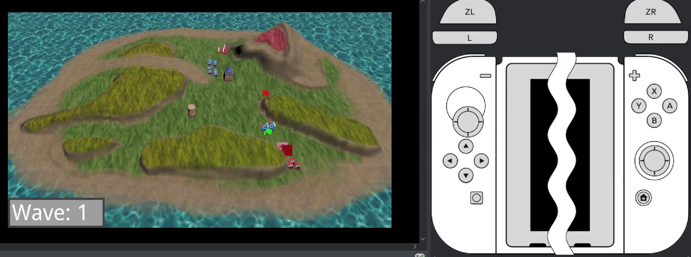

## Overview

Over the course of the 8 weeks, my group was tasked with creating a custom RTS engine that supported builds for PC and Switch. We had a basic starting point given to us from the lecturers but, must prominently, had to implement the cross platform support and gameplay from scratch. This was a challenging but satisfying block for me, I was able to learn how to use the switch dev-kit with my work on our input system. I also enjoyed exploring formation algorithms for the units!

## Features

- Billboarded sprites.
- Terrain/map editor.
- Particle system.
- FMOD sounds.
- Event system.
- Animations.
- Flow field navigation.

## Showcase

