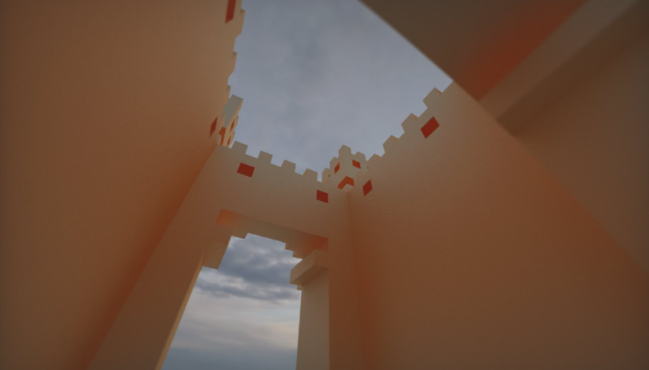
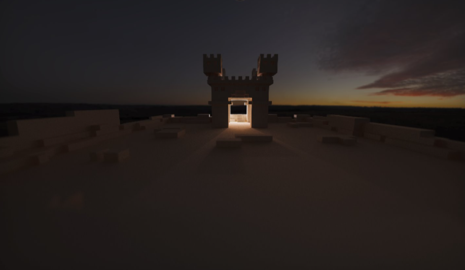

## Overview

During the 8 weeks of my block, I developed a cpu based ray tracer. This tested and trained my knowledge of linear algebra, geometry, and trigonometry. I enjoyed working through and translating the physics theory into software! Furthermore, as ray tracing is computationally intense and with the limitation of being cpu based, it was an excellent opportunity for me to learn about spatial data structures and measure algorithmic complexity.

## Features

- Point lights.
- Spotlights.
- Directional lights.
- Mirrors.
- Glass.
- Spheres.
- Depth-of-field.
- MagicaVoxel model loading.

## Showcase

